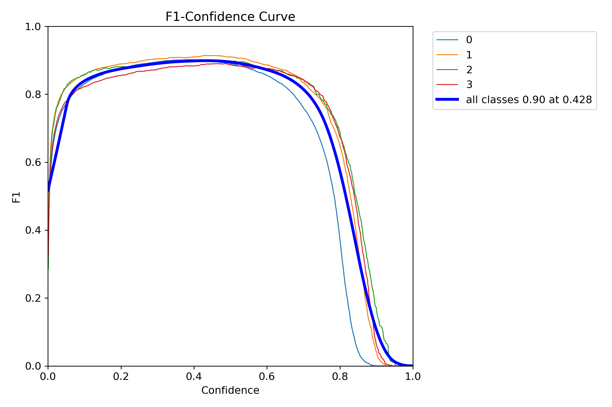
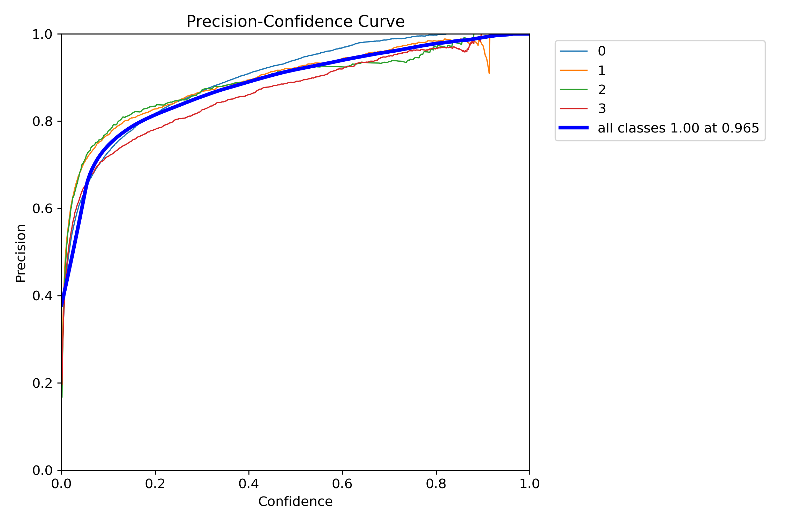
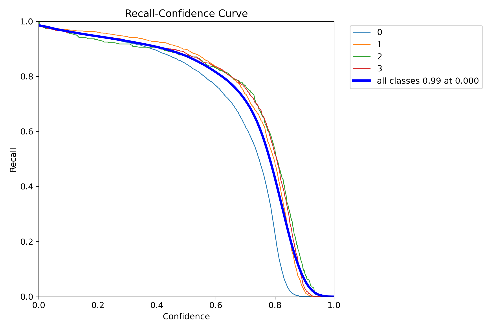
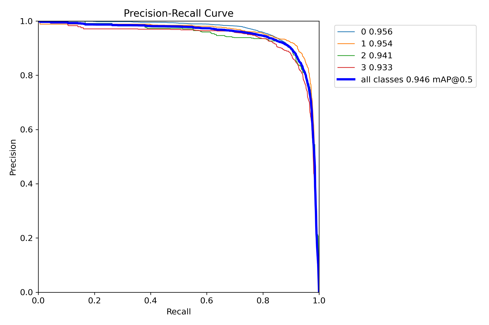
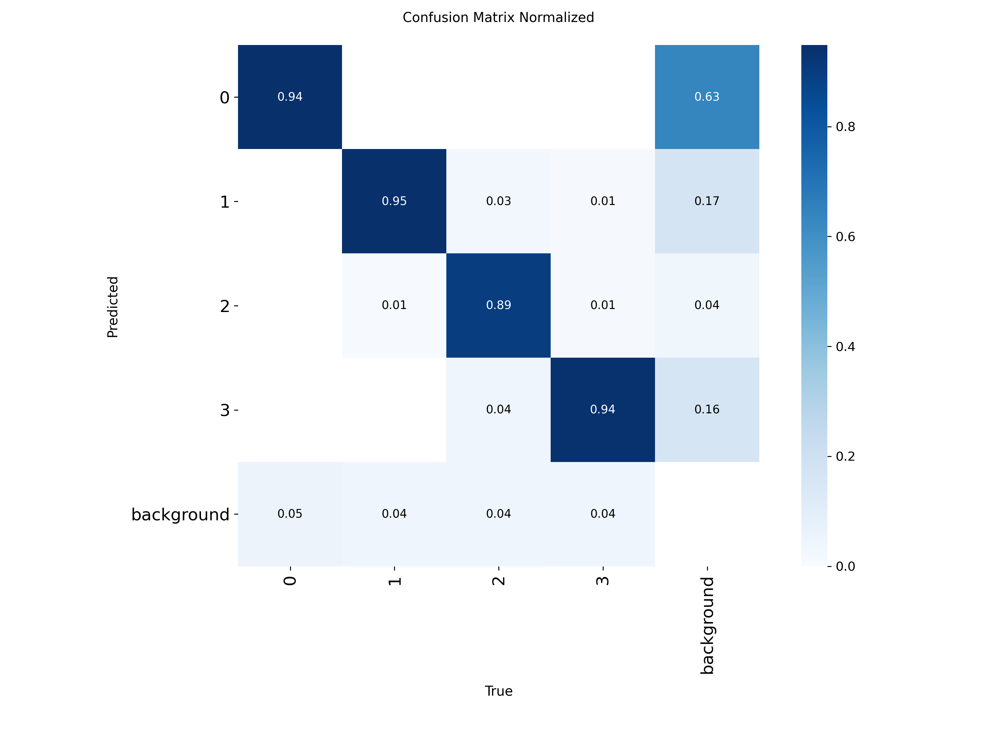
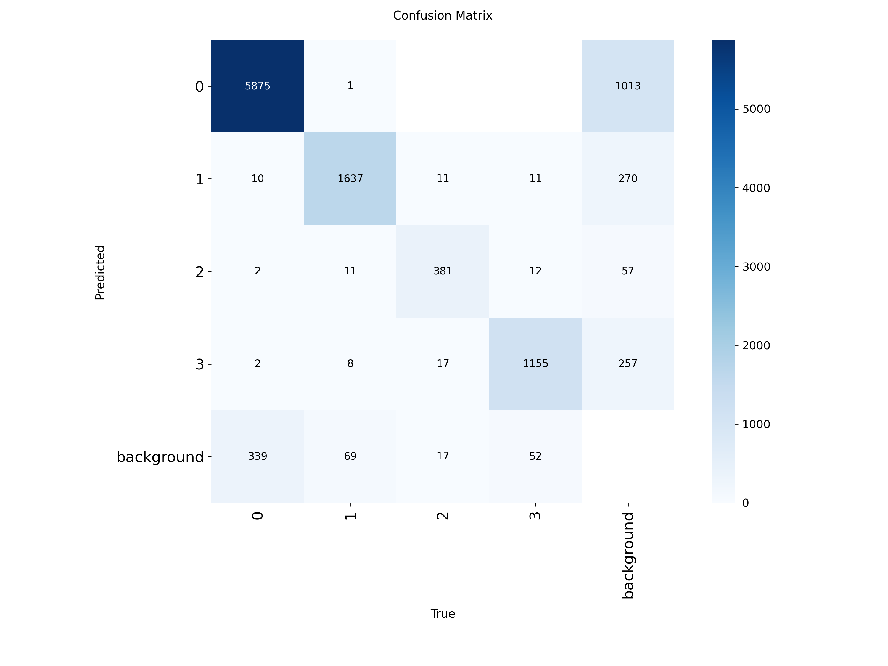
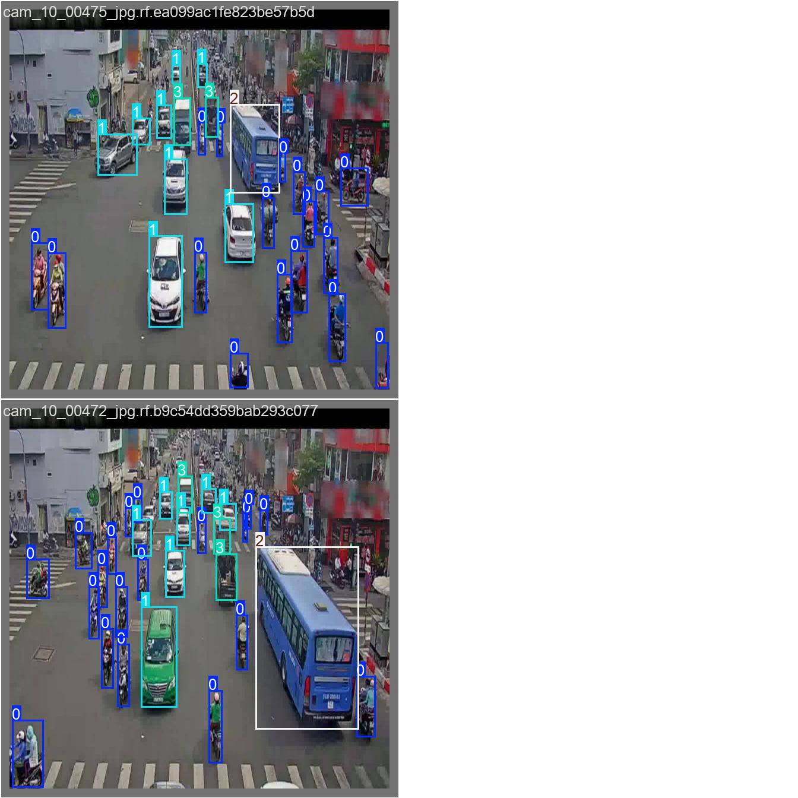
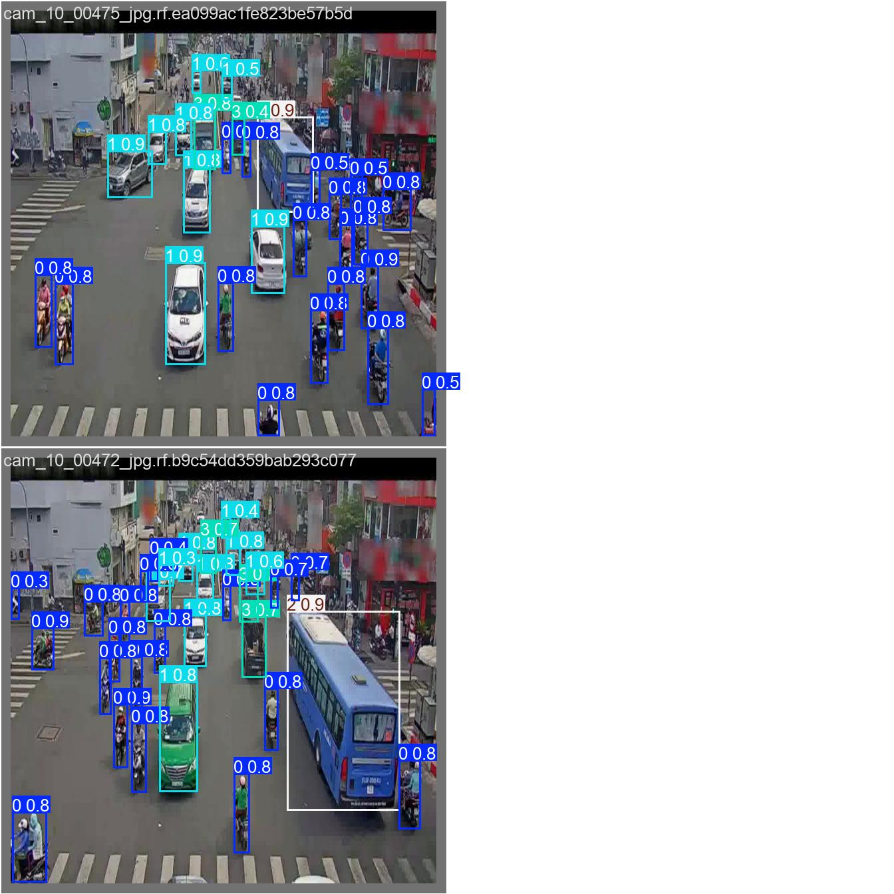
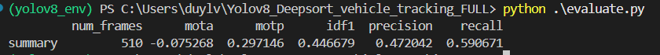

# 📘 YOLOv8 + DeepSORT Vehicle Tracking
Dự án này thực hiện phát hiện và theo dõi đa đối tượng (Multi-Object Tracking – MOT) trong video giao thông Việt Nam.

Mô hình YOLOv8 được huấn luyện để nhận diện 4 loại phương tiện:
- Class ID: 0, nhãn: Motobike
- Class ID: 1, nhãn: Car
- Class ID: 2, nhãn: Bus
- Class ID: 3, nhãn: Truck. Sau khi phát hiện, các bounding box được đưa vào DeepSORT để gán ID và theo dõi đối tượng xuyên suốt video.

---

## 📊 Dataset
Dữ liệu dùng để train model được tải về từ Roboflow khi chạy `python train_model.py`, tại dòng code:
```
    # ============================
    # 1. TẢI DATASET TỪ ROBOFLOW
    # ============================
    rf = Roboflow(api_key="d6Ftxh41wdgfXKN8QeoO")
    project = rf.workspace("duy-6d40k").project("cacacacaca-smvlx")
    version = project.version(3)

    print("Đang tải dataset từ Roboflow...")
    # dataset.location là đường dẫn dataset
    dataset = version.download("yolov8")

    data_yaml = os.path.join(dataset.location, "data.yaml")
    if not os.path.exists(data_yaml):
        raise FileNotFoundError("Không tìm thấy file data.yaml trong dataset!")
```
---

## 🧠 Mô tả kỹ thuật
### 1. Phát hiện (Detection) – YOLOv8
YOLOv8 dự đoán cho mỗi đối tượng:
- Bounding box (x1, y1, x2, y2)
- confidence
- class_id = {0,1,2,3}. Kết quả của YOLO được chuyển sang chuẩn xywh để đưa vào DeepSORT.
### 2. Theo dõi (Tracking) – DeepSORT
DeepSORT tạo track ID bằng:
- Kalman Filter (dự đoán vị trí tiếp theo)
- Appearance Embedding (nhận dạng ngoại hình). Track ID ổn định giúp bạn theo dõi phương tiện xuyên suốt video.
### 3. Vẽ kết quả
Mỗi class có 1 màu cố định:
-   Xe máy	(255, 0, 0) – xanh dương
-   Xe con	(0, 0, 255) – đỏ
-   Xe buýt	(0, 255, 255) – vàng
-   Xe tải	(255, 0, 255) – tím.

---

## ▶️ Cách chạy tracking YOLOv8 + DeepSORT
### 1. Cài đặt thư viện
``` 
pip install ultralytics
pip install deep-sort-realtime
pip install opencv-python
```
### 2. Huấn luyện và đánh giá model
- Lệnh: ` python train_model.py` để cho kết quả file tham số best_85epochs.pt
- Sau đó chạy lệnh: ` python val_model.py` để đánh giá model ở các thông số confusion_matrix, PR_curve, F1_curve, results và labels
- Kết quả đánh giá của model như sau:

Tức là conf = 0.428 là giá trị tối ưu giúp model cân bằng tốt nhất giữa: precision (độ chính xác) và recall (độ bao phủ)


Khi đặt conf = 0.965 model sẽ dự đoán rất chính xác (precision cao) nhưng bỏ sót hàng loạt xe (recall thấp)



Tức là YOLO phát hiện gần toàn bộ đối tượng khi không lọc gì cả



Đây là giá trị Mean Average Precision tại ngưỡng IoU = 0.5, kết quả 0.946 ~ 94.6% là RẤT CAO.
Model phát hiện các đối tượng rất tốt, rất chính xác khi chỉ yêu cầu IoU ≥ 0.5









Kiểm tra khả năng nhận diện các class từ 0 đến 3 với 2 ảnh bất kì



Kiểm tra khả năng dự đoán với 2 ảnh bất kì


### 3. Chạy thử với ảnh đơn lẻ
- Lệnh: ` python test_model.py`

### 4. Chạy thử với video khác
- Lệnh: ` python track_yolov8_deepsort.py` 
- Kết quả: cửa sổ hiển thị video tracking real-time, file output_tracking.mp4 được tạo tự động và lưu các predictions thành file .txt để sử dụng cho đánh giá model

### 5. Đánh giá thêm model với video khác
- Lệnh: ` python evaluate.py` 
- Kết quả: đánh giá predictions.txt do model tạo ra và VNTraffic_GroundTruth.txt do giảng viên cung cấp

Đánh giá cho thấy:
-   Số lượng frame trong video được chia thành 510
-   Chỉ số MOTA = -0.075 cho thấy khi tracking sẽ mất nhiều xe, track sẽ sai nhiều ID,...
-   MOTP = 0.29 bbox dự đoán khá khớp, YOLO xác định bbox ổn nhưng traking object kém
-   IDF1 = 0.446679 (~44%) gần 1 nửa đối tượng có thể bị track sai ID
-   Precision = 0.472 (~47%) YOLO tạo ra nhiều false positive, detect nhiều vật thể nhưng vẫn có thể bị sai
-   Recall = 0.590 (~59%) YOLO phát hiện được 59% trong tất cả object thật

---

## 📜 Giải thích code chính (track_yolov8_deepsort.py)
### 1. Load YOLO
`model = YOLO("best_85epochs.pt")`
### 2. Khởi tạo DeepSORT
```
 tracker = DeepSort(
        max_age=40,
        n_init=3,
        nn_budget=200,
        max_cosine_distance=0.4,
        max_iou_distance=0.7,
        nms_max_overlap=0.6
    )
```
### 3. Chạy qua từng frame video
`results = model(frame, conf=0.15)[0]`
### 4. Chuyển YOLO → DeepSORT
`detections_for_tracker.append([[x1, y1, w, h], conf, cls])`
### 5. DeepSORT cập nhật track
`tracks = tracker.update_tracks(detections_for_tracker, frame=frame)`
### 6. Vẽ bounding box theo class
```
color = CLASS_COLORS[cls]
cv2.rectangle(...)
```
🎥 Kết quả, video đầu ra có: 
-   Bounding box bao quanh mỗi phương tiện
-   Màu theo classID theo DeepSORT
-   Tracking ổn định xuyên suốt video

---

## 📌 Kết luận

Kết quả đánh giá cho thấy mô hình **YOLOv8 kết hợp DeepSORT** có khả năng phát hiện phương tiện tương đối tốt trên tập dữ liệu validation ban đầu.  
Các chỉ số như **Precision, Recall, mAP**, cùng các biểu đồ **PR Curve, F1 Curve** đều chỉ ra rằng mô hình đã học được những đặc trưng quan trọng của phương tiện trong môi trường giao thông.

Tuy nhiên, khi áp dụng mô hình vào **video thực nghiệm nằm ngoài tập dữ liệu validation**, hiệu suất giảm đáng kể. Nguyên nhân đến từ một số vấn đề chính:

### ⚠️ Nguyên nhân giảm hiệu suất
- **Tập dữ liệu huấn luyện chưa đủ lớn và chưa đa dạng**, đặc biệt là về:
  - Góc quay camera  
  - Mật độ giao thông  
  - Điều kiện ánh sáng  
  - Độ che khuất  
  - Sự khác biệt giữa camera của video đánh giá và camera của dataset huấn luyện

- **Sai số trong phát hiện (Detection Error)**:
  - Bỏ sót phương tiện (False Negative)  
  - Nhận nhầm vật thể (False Positive)

- **DeepSORT phụ thuộc hoàn toàn vào chất lượng bounding box từ YOLO**.  
  Khi YOLO dự đoán sai, tracker dễ bị:
  - Mất ID  
  - Gán nhầm ID  

- **Mật độ phương tiện cao** trong video thực nghiệm làm tăng số lượng va chạm giữa bounding box → tăng ID switch → giảm MOTA.

### ✅ Khả năng đáp ứng của mô hình
Mặc dù gặp nhiều hạn chế ở dữ liệu ngoài phân phối, mô hình hiện tại vẫn:
- Dự đoán vị trí phương tiện khá ổn định  
- Theo dõi mục tiêu xuyên suốt phần lớn thời gian  
- **Đáp ứng yêu cầu cơ bản của bài toán Vehicle Tracking**

Điều này cho phép mô hình sử dụng cho các nhiệm vụ như:
- Quan sát giao thông  
- Đếm phương tiện cơ bản  
- Thống kê mật độ giao thông mức đơn giản  

### 🔧 Hướng cải thiện trong tương lai
Để mô hình ổn định hơn trong thực tế, có thể xem xét:

- **Mở rộng và đa dạng hóa dataset**:
  - Thêm nhiều góc quay, thời tiết, ban ngày/ban đêm  
  - Thêm tình huống giao thông đông đúc, che khuất  

- **Tăng số lượng epoch hoặc dùng phiên bản YOLO lớn hơn** (YOLOv8m, YOLOv8l,...)

- **Tinh chỉnh hoặc thay thế thuật toán tracking** bằng các phương pháp hiện đại hơn:
  - **OC-SORT**
  - **ByteTrack**
  - **BoT-SORT**